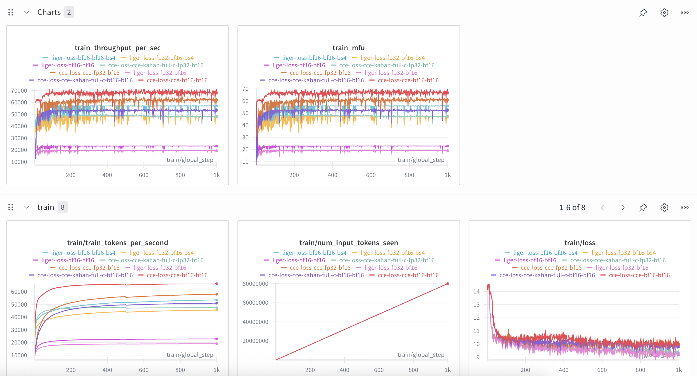

# Cross Entropy Loss Comparison

Compare [Liger Kernel](https://github.com/linkedin/Liger-Kernel) fused linear cross-entropy vs [Apple Cut Cross-Entropy (CCE)](https://github.com/apple/ml-cross-entropy) for fine-tuning language models without `torch.compile` (required due to dynamic sequence lengths with multipacking).

Dataset: [malaysia-ai/multipacking-multilingual-tts-10k-qwen3](https://huggingface.co/datasets/malaysia-ai/multipacking-multilingual-tts-10k-qwen3)

## Setup

1. Install dependencies:

```bash
bash install.sh
```

2. Download the dataset:

```bash
hf download malaysia-ai/multipacking-multilingual-tts-10k-qwen3 --repo-type=dataset --local-dir=./multipacking
```

## Experiments

All experiments use `Qwen/Qwen3-0.6B-Base` with Flash Attention 3, sequence length 10240, and 1000 training steps.

| Script | Loss | dtype | Batch Size |
|--------|------|-------|------------|
| `liger-bf16.sh` | Liger fused linear CE | bf16 | 1 |
| `liger-fp32.sh` | Liger fused linear CE | fp32 | 1 |
| `liger-bf16-bs4.sh` | Liger fused linear CE | bf16 | 4 |
| `liger-fp32-bs4.sh` | Liger fused linear CE | fp32 | 4 |
| `cce-bf16.sh` | CCE (`cce`) | bf16 | 1 |
| `cce-fp32.sh` | CCE (`cce`) | fp32 | 1 |
| `cce-kahan-full-c-bf16.sh` | CCE (`cce_kahan_full_c`) | bf16 | 1 |
| `cce-kahan-full-c-fp32.sh` | CCE (`cce_kahan_full_c`) | fp32 | 1 |
| `triton-bf16.sh` | V-chunk online softmax (chunk=2048) | bf16 | 1 |

Run any experiment with:

```bash
bash liger-bf16.sh
```

## WanDB Results

MFU and throughput tracked at https://wandb.ai/aies-scicom-scicom-ai/liger-vs-cce



## V-Chunk Online Softmax Benchmark

Benchmarks a memory-efficient V-chunked logprob/entropy computation using online softmax, adapted from [PrimeIntellect prime-rl](https://github.com/PrimeIntellect-ai/prime-rl/blob/main/src/prime_rl/trainer/models/layers/lm_head.py#L121) with a Triton kernel for speed.

```bash
python3 online_softmax_chunk.py
```

<details>
<summary>Benchmark output</summary>

```
================================================================================
ONLINE SOFTMAX LOGPROBS/ENTROPY BENCHMARK
================================================================================

================================================================================
CORRECTNESS TEST (Small Scale)
================================================================================

PyTorch vs Reference:
  LogProbs: PASS (max diff: 4.20e-05)
  Entropy:  FAIL (max diff: 1.91e-05)

Triton vs Reference:
  LogProbs: PASS (max diff: 4.20e-05)
  Entropy:  FAIL (max diff: 1.91e-05)

Triton vs PyTorch Chunked:
  LogProbs: PASS (max diff: 0.00e+00)
  Entropy:  FAIL (max diff: 1.53e-05)

================================================================================
EDGE CASE TESTS
================================================================================

1. Labels at chunk boundaries:
  PyTorch: PASS (diff: 0.00e+00)
  Triton:  PASS (diff: 0.00e+00)

2. Single token:
  PyTorch: PASS
  Triton:  PASS

3. Chunk size > vocab:
  PyTorch: PASS
  Triton:  PASS

4. Large logits (numerical stability):
  PyTorch: PASS (diff: 0.00e+00)
  Triton:  PASS (diff: 0.00e+00)

================================================================================
MEMORY SCALING TEST
================================================================================

================================================================================
Config: Small Vocab (32K): N=2048, H=4096, V=32000, chunk=2048
================================================================================
Implementation            LogP Match   Ent Match    LogP Diff    Ent Diff     Memory (MB)  Time (ms)      
----------------------------------------------------------------------------------------------------
No Chunk (Baseline)       ✓            ✓            0.00e+00     0.00e+00     1024.2       11.72 ± 0.00
V-Chunk PyTorch           ✓            ✗            3.05e-05     7.63e-05     322.3        14.42 ± 0.18
V-Chunk Triton            ✓            ✗            3.05e-05     7.63e-05     322.2        10.60 ± 0.01

================================================================================
Config: Medium Vocab (64K): N=2048, H=4096, V=65536, chunk=2048
================================================================================
Implementation            LogP Match   Ent Match    LogP Diff    Ent Diff     Memory (MB)  Time (ms)      
----------------------------------------------------------------------------------------------------
No Chunk (Baseline)       ✓            ✓            0.00e+00     0.00e+00     2072.2       23.04 ± 0.02
V-Chunk PyTorch           ✓            ✗            3.05e-05     9.16e-05     584.3        29.41 ± 0.05
V-Chunk Triton            ✓            ✗            3.05e-05     9.16e-05     584.2        21.81 ± 0.01

================================================================================
Config: Large Vocab (128K): N=2048, H=4096, V=128000, chunk=2048
================================================================================
Implementation            LogP Match   Ent Match    LogP Diff    Ent Diff     Memory (MB)  Time (ms)      
----------------------------------------------------------------------------------------------------
No Chunk (Baseline)       ✓            ✓            0.00e+00     0.00e+00     4024.2       44.98 ± 0.01
V-Chunk PyTorch           ✗            ✗            2.00e+00     4.20e-01     1072.3       57.33 ± 0.06
V-Chunk Triton            ✗            ✗            2.00e+00     4.20e-01     1072.2       42.53 ± 0.01

================================================================================
PERFORMANCE SCALING TEST
================================================================================

================================================================================
Config: Batch 1K, Chunk 1K: N=1024, H=4096, V=128000
================================================================================
Implementation            LogP Match   Ent Match    LogP Diff    Ent Diff     Memory (MB)  Time (ms)      
----------------------------------------------------------------------------------------------------
No Chunk (Baseline)       ✓            ✓            0.00e+00     0.00e+00     2516.2       22.61 ± 0.01
V-Chunk PyTorch           ✗            ✗            2.50e+00     5.39e-01     1028.2       39.74 ± 0.07
V-Chunk Triton            ✗            ✗            2.50e+00     5.39e-01     1028.2       22.15 ± 0.04

================================================================================
Config: Batch 1K, Chunk 2K: N=1024, H=4096, V=128000
================================================================================
Implementation            LogP Match   Ent Match    LogP Diff    Ent Diff     Memory (MB)  Time (ms)      
----------------------------------------------------------------------------------------------------
No Chunk (Baseline)       ✓            ✓            0.00e+00     0.00e+00     2516.2       22.61 ± 0.01
V-Chunk PyTorch           ✗            ✗            2.50e+00     6.32e-01     1040.2       31.14 ± 0.06
V-Chunk Triton            ✗            ✗            2.50e+00     6.32e-01     1040.2       20.29 ± 0.03

================================================================================
Config: Batch 1K, Chunk 4K: N=1024, H=4096, V=128000
================================================================================
Implementation            LogP Match   Ent Match    LogP Diff    Ent Diff     Memory (MB)  Time (ms)      
----------------------------------------------------------------------------------------------------
No Chunk (Baseline)       ✓            ✓            0.00e+00     0.00e+00     2516.2       22.61 ± 0.02
V-Chunk PyTorch           ✗            ✗            2.50e+00     8.18e-01     1064.2       26.87 ± 0.02
V-Chunk Triton            ✗            ✗            2.50e+00     8.18e-01     1064.2       19.79 ± 0.01

================================================================================
Config: Batch 4K, Chunk 2K: N=4096, H=4096, V=128000
================================================================================
Implementation            LogP Match   Ent Match    LogP Diff    Ent Diff     Memory (MB)  Time (ms)      
----------------------------------------------------------------------------------------------------
No Chunk (Baseline)       ✓            ✓            0.00e+00     0.00e+00     7040.2       89.52 ± 0.01
V-Chunk PyTorch           ✓            ✗            0.00e+00     1.22e-04     1136.4       106.53 ± 0.10
V-Chunk Triton            ✓            ✗            0.00e+00     1.22e-04     1136.3       84.02 ± 0.08

================================================================================
Config: Batch 8K, Chunk 2K: N=8192, H=4096, V=128000
================================================================================
Implementation            LogP Match   Ent Match    LogP Diff    Ent Diff     Memory (MB)  Time (ms)      
----------------------------------------------------------------------------------------------------
No Chunk (Baseline)       ✓            ✓            0.00e+00     0.00e+00     13072.4      178.00 ± 0.03
V-Chunk PyTorch           ✗            ✗            2.00e+00     3.59e-01     1264.6       186.22 ± 0.05
V-Chunk Triton            ✗            ✗            2.00e+00     3.59e-01     1264.5       150.08 ± 0.07

================================================================================
FORWARD+BACKWARD BENCHMARK (V-Chunk vs Liger vs CCE)
================================================================================
Skipping import of cpp extensions due to incompatible torch version 2.8.0+cu128 for torchao version 0.14.1             Please see https://github.com/pytorch/ao/issues/2919 for more info

================================================================================
Config: Medium Vocab (64K): N=2048, H=4096, V=65536, chunk=8192
================================================================================
Implementation         Loss Match   Loss Diff    Grad Match   Grad Diff    Memory (MB)  Time (ms)      
---------------------------------------------------------------------------------------------------------
No Chunk (Baseline)    ✓            0.00e+00     ✓            0.00e+00     3696.3       119.37 ± 0.73
V-Chunk PyTorch        ✓            0.00e+00     ✗            3.12e-02     2176.3       177.40 ± 0.10
V-Chunk Triton         ✓            0.00e+00     ✗            3.12e-02     2048.3       174.86 ± 6.27
Liger                  ✗            3.64e+01     ✗            1.93e+00     3168.3       110.74 ± 0.07
CCE (kahan_full_c)     ✗            2.88e+00     ✗            3.12e-02     2656.9       94.00 ± 0.11

================================================================================
Config: Large Vocab (128K): N=2048, H=4096, V=128000, chunk=8192
================================================================================
Implementation         Loss Match   Loss Diff    Grad Match   Grad Diff    Memory (MB)  Time (ms)      
---------------------------------------------------------------------------------------------------------
No Chunk (Baseline)    ✓            0.00e+00     ✓            0.00e+00     7112.3       237.80 ± 0.56
V-Chunk PyTorch        ✓            6.25e-02     ✗            3.12e-02     3640.3       346.58 ± 0.65
V-Chunk Triton         ✓            6.25e-02     ✗            3.12e-02     3512.3       338.08 ± 0.30
Liger                  ✗            5.28e+01     ✗            2.05e+00     6095.9       403.56 ± 0.13
CCE (kahan_full_c)     ✗            3.06e+00     ✗            3.12e-02     5097.5       165.45 ± 0.11

================================================================================
Config: Batch 4K, Vocab 128K: N=4096, H=4096, V=128000, chunk=8192
================================================================================
Implementation         Loss Match   Loss Diff    Grad Match   Grad Diff    Memory (MB)  Time (ms)      
---------------------------------------------------------------------------------------------------------
No Chunk (Baseline)    ✓            0.00e+00     ✓            0.00e+00     10144.3      465.72 ± 0.77
V-Chunk PyTorch        ✓            0.00e+00     ✗            3.12e-02     4008.3       661.62 ± 0.33
V-Chunk Triton         ✓            0.00e+00     ✗            3.12e-02     3688.3       647.83 ± 0.23
Liger                  ✗            2.94e+01     ✗            2.05e+00     6175.6       423.40 ± 0.13
CCE (kahan_full_c)     ✗            6.25e+00     ✗            3.12e-02     5177.5       322.04 ± 0.14

================================================================================
Config: Batch 10K, Vocab 128K: N=10240, H=4096, V=128000, chunk=8192
================================================================================
Implementation         Loss Match   Loss Diff    Grad Match   Grad Diff    Memory (MB)  Time (ms)      
---------------------------------------------------------------------------------------------------------
No Chunk (Baseline)    ✓            0.00e+00     ✓            0.00e+00     19336.3      1161.06 ± 0.85
V-Chunk PyTorch        ✓            0.00e+00     ✗            3.12e-02     5304.4       1609.93 ± 0.87
V-Chunk Triton         ✓            0.00e+00     ✗            3.12e-02     4344.4       1579.46 ± 0.54
Liger                  ✗            5.40e+01     ✗            2.34e+00     6461.4       572.99 ± 0.14
CCE (kahan_full_c)     ✗            1.52e+01     ✗            3.12e-02     5417.6       794.56 ± 0.23
```

</details>
