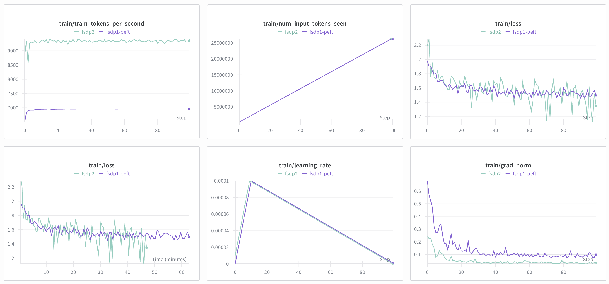

# FSDP1 vs FSDP2

Comparing loss FSDP1 vs HSDP2 on Qwen3 32B dense LoRA on all linear layers on the same global batch size.

## How to

1. Prepare the dataset,

```bash
HF_HUB_ENABLE_HF_TRANSFER=0 hf download Scicom-intl/mosaic-ms-wikipedia-2023-10-01 --repo-type=dataset --local-dir=./multipacking
```

2. Run the finetuning,

```bash
bash fsdp2.sh
```

## WanDB

https://wandb.ai/aies-scicom-scicom-ai/fsdp1-peft-vs-fsdp2

