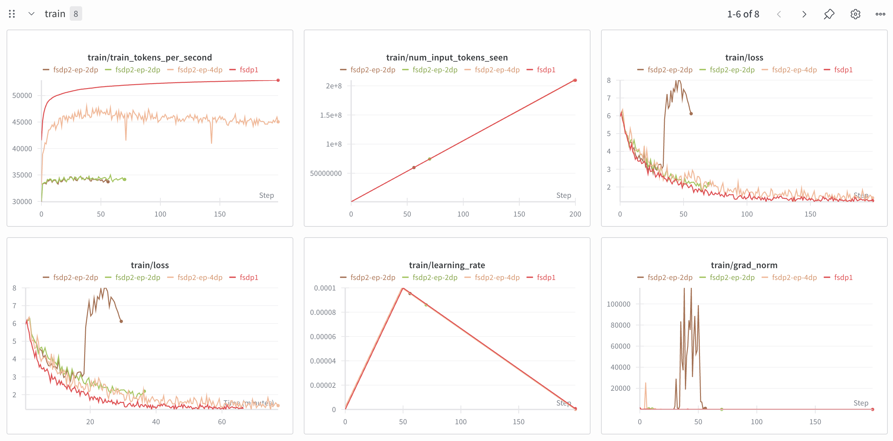

# FSDP vs HSDP

Comparing throughput FSDP vs HSDP on Qwen3 14B dense LoRA on all linear layers on the same global batch size.

## How to

1. Prepare the dataset,

```bash
HF_HUB_ENABLE_HF_TRANSFER=0 hf download Scicom-intl/malaysian-reasoning-16k-mosaic --repo-type=dataset --local-dir=./malaysian-reasoning-16k-mosaic
```

2. Run the finetuning,

```bash
bash fsdp1.sh
```

## WanDB

https://wandb.ai/aies-scicom-scicom-ai/fsdp1-vs-fsdp2-ep

