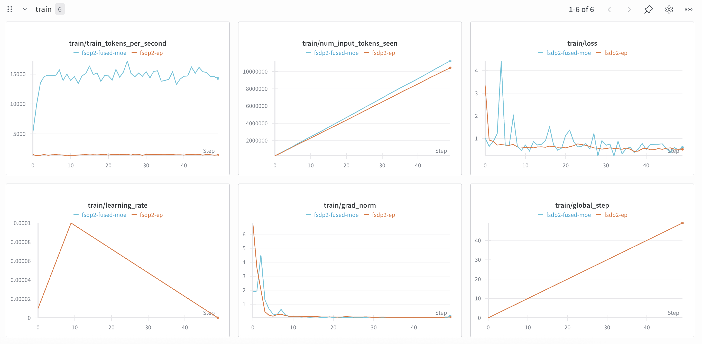

# FSDP2-EP vs FSDP2 Fused MoE

Because we build a lot our own FSDP2 EP MoE LORA script, I think we should compare the loss using the FSDP2 Fused MoE with zai-org/GLM-4.5-Air, applying LoRA to all linear layers including the experts, while keeping the global batch size the same.

## How to

1. Prepare the dataset,

```bash
HF_HUB_ENABLE_HF_TRANSFER=0 hf download Scicom-intl/Malaysian-Instructions-multipacking-glm --repo-type=dataset --local-dir=./multipacking-glm
```

Script to prepare the dataset at [../malaysian-sft/notebook/multipack-malaysian-instructions-glm.ipynb](../malaysian-sft/notebook/multipack-malaysian-instructions-glm.ipynb)

2. Stack the experts,

```bash
python3 stack-checkpoint.py
```

3. Run the finetuning,

```bash
bash fsdp2-fused-moe.sh
```

## WanDB

https://wandb.ai/aies-scicom-scicom-ai/fsdp2-ep-vs-fsdp2-fused-moe

