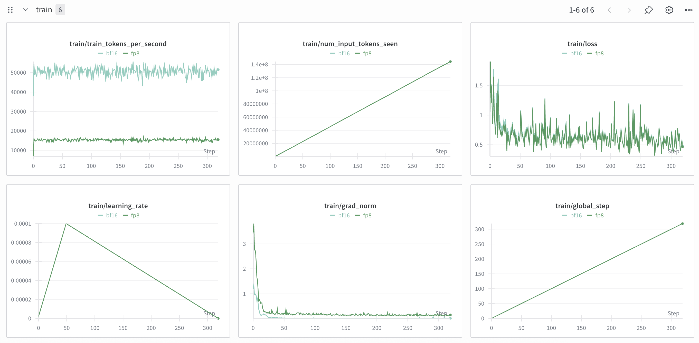

# FSDP2 Fused MoE LoRA BF16 vs FP8

We should compare the loss using the FSDP2 Fused MoE with Qwen/Qwen3-30B-A3B-Instruct-2507, applying LoRA to all linear layers including the experts where the base layers in lower precision such as FP8, while keeping the global batch size the same.

## How to

1. Prepare the dataset, [../malaysian-sft/notebook/multipack-malaysian-instructions-glm3.ipynb](../malaysian-sft/notebook/multipack-malaysian-instructions-glm.ipynb)

2. Stack the experts,

For BF16,

```bash
python3 stack-checkpoint-transpose.py
```

For FP8,

```bash
python3 stack-checkpoint.py 
```

FP8 required to be in column major for the weight but major problem if move to column major it will become non-contiguous so FSDP2 cannot shard it, so what we can do, we save as row major contiguously during forward we will transpose to become column major.

3. Run the finetuning,

```bash
bash fsdp2-fused-moe.sh
```

4. Run generation,

```bash
python3 malaymmlu.py --pattern "Qwen3-30B-A3B-Instruct-2507-lora-256-*f*" --num_gpus 8 --gpu_partition 4
```

5. Calculate accuracy,

```bash
python3 calculate_malaymmlu.py --pattern "malaymmlu-Qwen3-30B-A3B-Instruct-2507-lora-256-*f*"
```

```
malaymmlu-Qwen3-30B-A3B-Instruct-2507-lora-256-fp8 72564
malaymmlu-Qwen3-30B-A3B-Instruct-2507-lora-256-bf16 72635

malaymmlu-Qwen3-30B-A3B-Instruct-2507-lora-256-fp8
STEM 0.8510028653295129 0.8943921408104789
Language 0.7865776081424937 0.8659351145038168
Social science 0.7338826250361377 0.8287077189939289
Others 0.7716478771887743 0.8642360278244183
Humanities 0.7947667804323094 0.884641638225256
average 0.7875755512258455 0.8675825280715799

malaymmlu-Qwen3-30B-A3B-Instruct-2507-lora-256-bf16
STEM 0.8067949242734344 0.9042161277118297
Language 0.7546119592875318 0.8780216284987278
Social science 0.6960104076322636 0.8352124891587164
Others 0.7349484288798273 0.8680738786279684
Humanities 0.7501706484641638 0.884641638225256
average 0.7485072737074442 0.8740331524444998
```

## WanDB

https://wandb.ai/aies-scicom-scicom-ai/fsdp2-fused-moe-lora-bf16-vs-fp8

