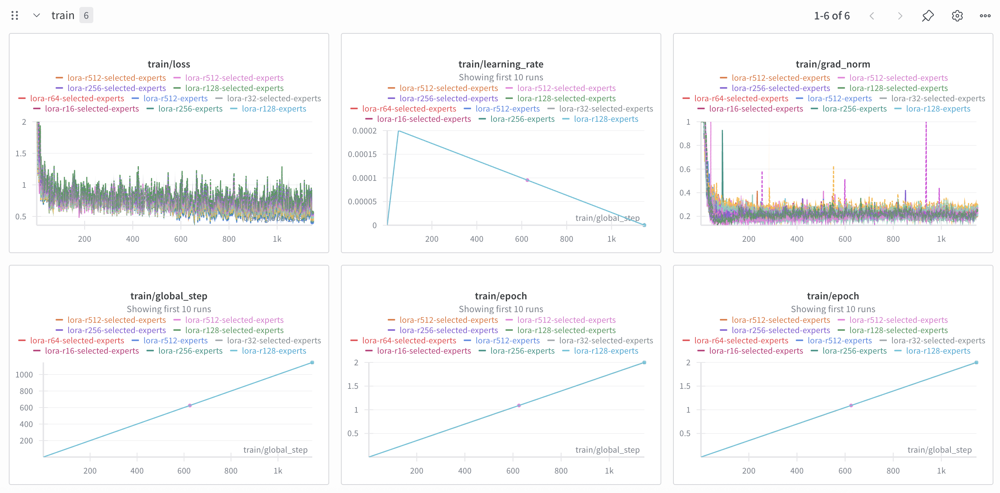
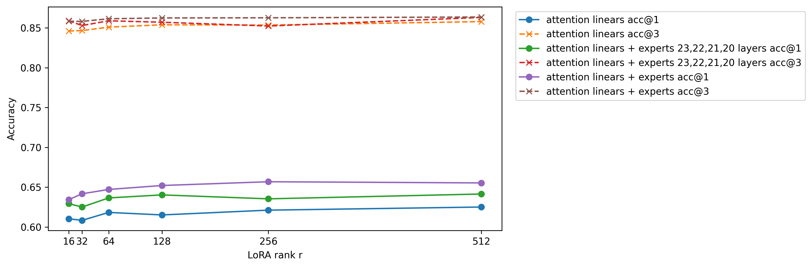

# Malaysian Reasoning

LoRA SFT on https://huggingface.co/datasets/mesolitica/Malaysian-Reasoning

## Ablation on GPT OSS 20B

1. Use `kernels-community/vllm-flash-attn3` for Flash Attention 3 with Sink.
2. Multipacking variable length 16384 context length, with global batch size of 8, so global total tokens is 65536.
3. All self attention linear layers with rank 16, 32, 64, 128, 256, 512 with alpha multiply by 2.0
4. All expert gate up projection and down projection with rank 16, 32, 64, 128, 256, 512 with alpha multiply by 2.0 <sup> + </sup>
5. Selected expert gate up projection and down projection based on square root mean `exp_avg_sq`, [20b-r64-experts-gradient.sh](20b-r64-experts-gradient.sh), [notebook/sort-optimizer.ipynb](notebook/sort-optimizer.ipynb), top 4 selected layers are 23, 22, 21, 20. <sup> + </sup>
6. Liger fused cross entropy.
7. 2e-4 learning rate, 50 warmup, 2 epoch only.

<sup> + </sup> with the rank of each equal to the total rank divided by the number of active experts, https://thinkingmachines.ai/blog/lora/

### WanDB

https://wandb.ai/aies-scicom-scicom-ai/malaysian-reasoning-20b



### Benchmark

We benchmark using https://huggingface.co/datasets/UMxYTLAILabs/MalayMMLU



1. Merge with base model,

- merge self attention linear layers using PEFT LoRA checkpoints with base model, [notebook/merge-lora-20b.ipynb](notebook/merge-lora-20b.ipynb)
- merge custom made linear and expert layers with base model, [notebook/merge-manual.ipynb](notebook/merge-manual.ipynb)

2. Evaluating merge models using vLLM inside subprocess inside multiprocessing,

```bash
python3 malaymmlu.py --pattern '*-merged' --num_gpus 8
```

3. Calculate accuracy,

```bash
python3 calculate_malaymmlu.py --pattern 'malaymmlu-malaysian-reasoning-20b*'
```

```
malaymmlu-malaysian-reasoning-20b-lora-r512-experts-merged 0.4944662805130327 0.7711522548613984
malaymmlu-malaysian-reasoning-20b-lora-r128-experts-merged 0.4516388871677303 0.6049941136377719
malaymmlu-malaysian-reasoning-20b-lora-r128-merged 0.6151082108045597 0.8538741120105733
malaymmlu-malaysian-reasoning-20b-lora-r32-selected-experts-merged 0.5944926922262233 0.8365600508366872
malaymmlu-malaysian-reasoning-20b-lora-r128-selected-experts-merged 0.6058979018668429 0.8409053361969271
malaymmlu-malaysian-reasoning-20b-lora-r64-selected-experts-merged 0.598135874067937 0.8254349627174814
malaymmlu-malaysian-reasoning-20b-lora-r256-selected-experts-merged 0.6237604510985806 0.829088080886642
malaymmlu-malaysian-reasoning-20b-lora-r256-experts-merged 0.4916788779568767 0.7169771823320076
malaymmlu-malaysian-reasoning-20b-lora-r512-selected-experts-merged 0.608107538662509 0.8249968395769247
malaymmlu-malaysian-reasoning-20b-lora-r16-experts-merged 0.43287707291392474 0.6925068000350969
malaymmlu-malaysian-reasoning-20b-lora-r16-selected-experts-merged 0.6015023818248443 0.8407230975937462
malaymmlu-malaysian-reasoning-20b-lora-r32-experts-merged 0.4361610599673062 0.6942269637787146
malaymmlu-malaysian-reasoning-20b-lora-r16-merged 0.6103171980835949 0.8461093672559061
malaymmlu-malaysian-reasoning-20b-lora-r32-merged 0.6082934082273252 0.8466049892615232
malaymmlu-malaysian-reasoning-20b-lora-r64-merged 0.6182629166150415 0.850989138066328
malaymmlu-malaysian-reasoning-20b-lora-r512-merged 0.6250361376120266 0.8578862594474043
malaymmlu-malaysian-reasoning-20b-lora-r256-merged 0.6211126254491389 0.8535497460042126
```

### What we learnt

1. LoRA weight always in FP32, during merging, merge in FP32, only downcast to base layer precision during add, our custom Linear LoRA module achieved the same loss as PEFT LoRA, https://wandb.ai/aies-scicom-scicom-ai/malaysian-reasoning-20b/runs/bdgdqjhw
2. FSDP 1 is pain, I think everyone should move on from FSDP 1, for `use_orig_params=False` you cannot put trainable and non-trainable weights in the same module, so you have to wrap the trainable weights in separate module such as `nn.ModuleDict`, and if you use `huggingface.Trainer`, make sure you patch `self.accelerator.state.fsdp_plugin.auto_wrap_policy = fsdp_auto_wrap_policy(self.model)`.

## Scale up to GPT OSS 120B

We use 256 rank parameter for linear layers including experts, model pushed at https://huggingface.co/Scicom-intl/gpt-oss-120b-Malaysian-Reasoning-SFT-v0.1

## Evaluation

1. Run vLLM,

```bash
vllm serve malaysian-reasoning-120b-lora-r256-experts --max-model-len 10000 --tensor-parallel-size 4 --enable-expert-parallel
```

Achieved,

```
malaymmlu-120b 0.6650559616734811 0.8618923718663528
```

### WanDB

https://wandb.ai/aies-scicom-scicom-ai/malaysian-reasoning-120b