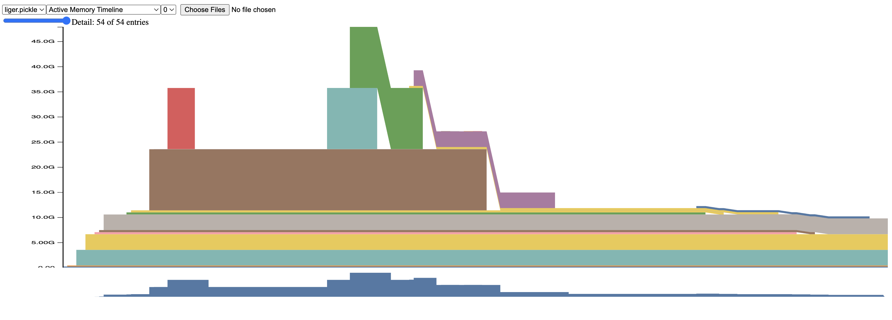
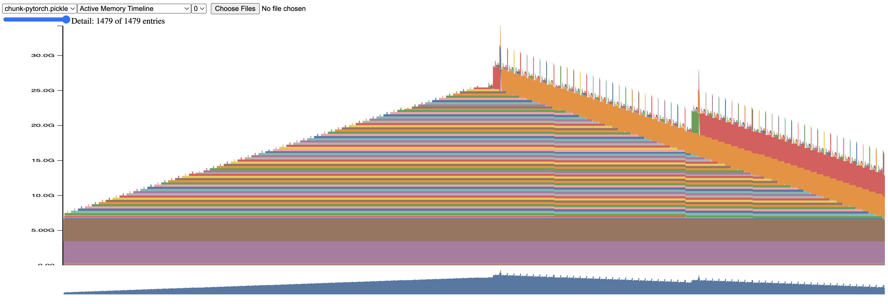

# Multipacking for DPO

We want to calculate sum inputs logprob and sum reference logprob without padding and lastly calculate DPO.

## Memory study

### Liger kernel

Problem with liger kernel DPO, the chunk happened on first dimension, which is the first dimension, if you are flash attention maxxing, we know flash attention designed for ragged tensor, 0 padding, so concatenated dimension happened on sequence dimension.

Average memory requirement for 10k sequence dimension is 44.6GB

### Naive Pytorch chunking

We chunk the tensor on sequence dimenstion, for each chunk do matmul with weight after calculate chunk sum logprob and add in global sum logprob.

Average memory requirement for 10k sequence dimension is 31.9GB