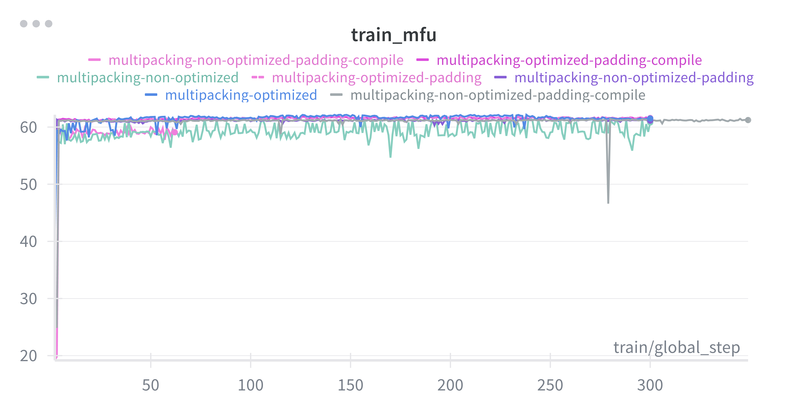
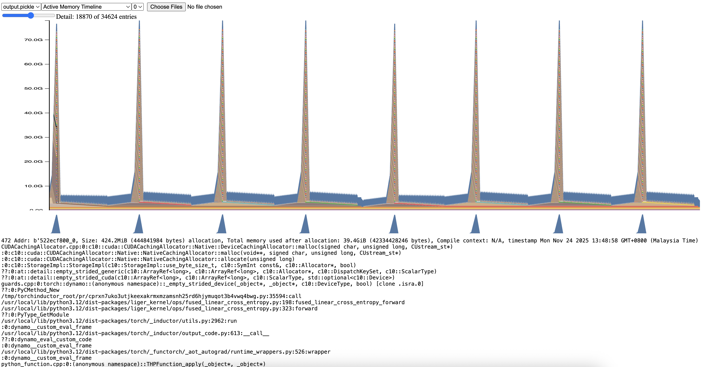
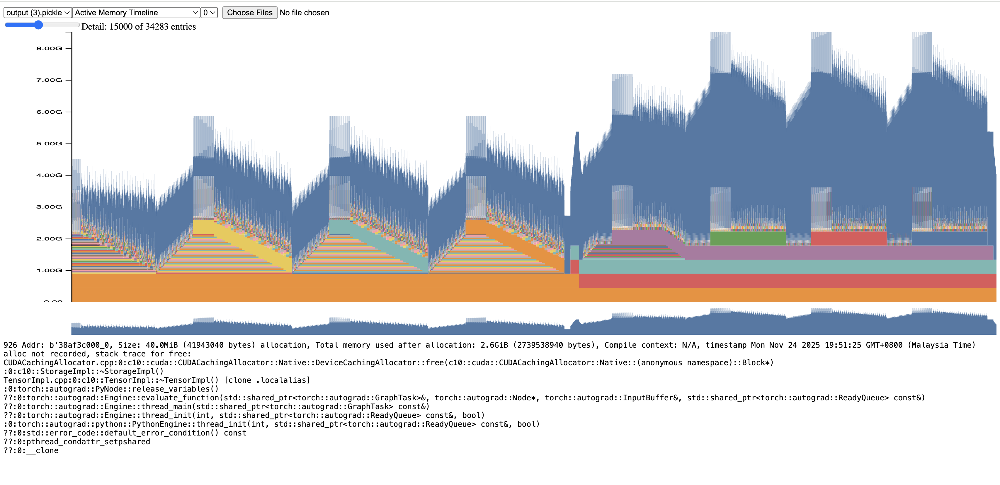

# Multipacking Padding FA3 Compile

Compare speed for optimized multipacking using bin packing vs non-optimized multipacking, include torch compile.

## How to

1. Install dependencies,

```bash
bash install.sh
```

2. Clone the dataset,

Non optimized,

```bash
HF_HUB_ENABLE_HF_TRANSFER=0 hf download malaysia-ai/multipacking-multilingual-tts-10k-qwen3 --repo-type=dataset --local-dir=./multipacking
```

Optimized,

```bash
HF_HUB_ENABLE_HF_TRANSFER=0 hf download Scicom-intl/multipacking-multilingual-tts-10k-qwen3-optimized --repo-type=dataset --local-dir=./multipacking-optimized
```

3. Run any script,

```bash
bash non-optimized-padding.sh
```

## WanDB

We also recorded MFU and Throughput per second, WanDB project at https://wandb.ai/aies-scicom-scicom-ai/multipacking-padding-fa3-compile



**Not different much**, so no need to waste your time to optimize your multipacking using bin packing.

## What we learnt

Default Liger can cause memory explode due to loop, before,



after,



We patched it at https://github.com/Scicom-AI-Enterprise-Organization/Liger-Kernel-remove-item