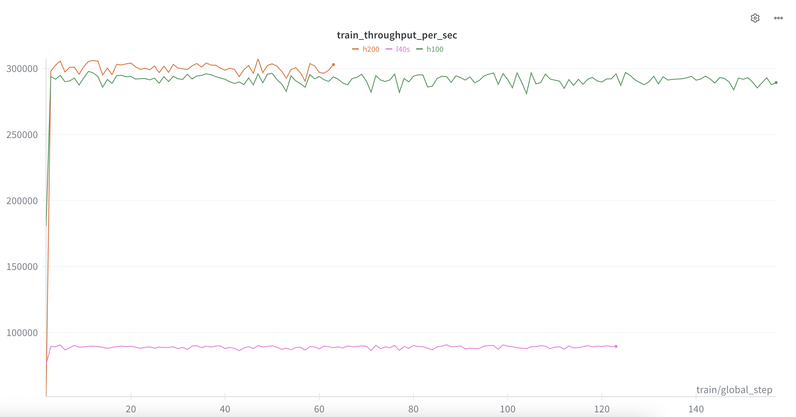

# TM Benchmark Training

Benchmark simple LLM training based on Qwen3-0.6B-Base.

## Important parameters

1. Only Malaysia Malay Wikipedia with total 90955776 tokens based on Qwen3 tokenizer.
2. 131072 token batch size, one batch size is 4096 tokens, so 32 batch size to achieve 131072 tokens.
3. DDP 4 GPUs.
4. 150 steps only.
5. Gradient checkpointing.

## How to

1. Install dependencies,

```bash
bash install.sh
```

2. Clone dataset,

```bash
HF_HUB_ENABLE_HF_TRANSFER=0 hf download Scicom-intl/mosaic-ms-wikipedia-2023-10-01 --repo-type=dataset --local-dir=./multipacking
```

3. Run training,

For L40s,

```bash
bash l40s.sh
```

## Report



WanDB at https://wandb.ai/aies-scicom-scicom-ai/h100-h200-l40s/

1. H200 throughput average 300k tokens per second.
2. H100 throughput average 292k tokens per second.
3. L40S throughput average 90k tokens per second.